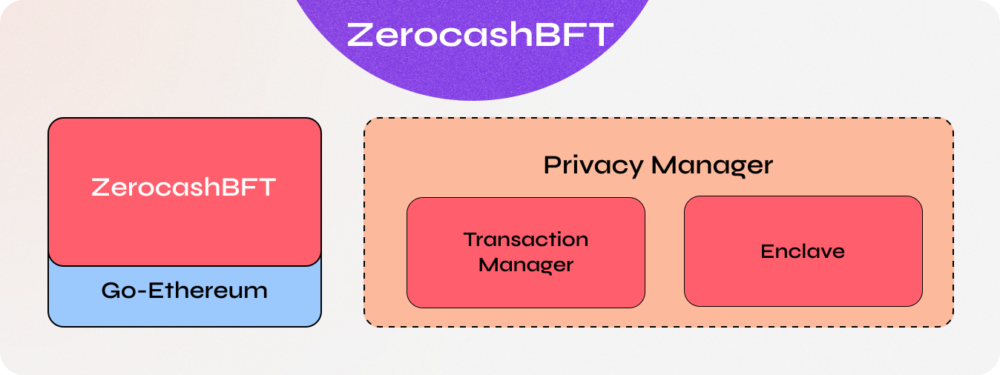

# ZerocashBFT

ZerocashBFT is an Ethereum-based distributed ledger protocol with transaction/contract privacy and new consensus mechanisms.

ZerocashBFT is a fork of [go-ethereum](https://github.com/ethereum/go-ethereum) and is updated in line with go-ethereum releases.

Key enhancements over go-ethereum:

* [__Privacy__](https://consensys.net/docs/goquorum//en/latest/concepts/privacy/privacy/) - ZerocashBFT supports private transactions and private contracts through public/private state separation, and utilises peer-to-peer encrypted message exchanges (see [Tessera](https://github.com/consensys/tessera)) for directed transfer of private data to network participants
* [__Alternative Consensus Mechanisms__](https://consensys.net/docs/goquorum//en/latest/concepts/consensus/overview/) - with no need for POW/POS in a permissioned network, ZerocashBFT instead offers multiple consensus mechanisms that are more appropriate for consortium chains:
  * [__QBFT__](https://consensys.net/docs/goquorum/en/latest/configure-and-manage/configure/consensus-protocols/qbft/) - Improved version of IBFT that is interoperable with Hyperledger Besu
  * [__Istanbul BFT__](https://consensys.net/docs/goquorum/en/latest/configure-and-manage/configure/consensus-protocols/ibft/) - a PBFT-inspired consensus algorithm with transaction finality, by AMIS.
  * [__Clique POA Consensus__](https://github.com/ethereum/EIPs/issues/225) - a default POA consensus algorithm bundled with Go Ethereum.
  * [__Raft-based Consensus__](https://consensys.net/docs/goquorum/en/latest/configure-and-manage/configure/consensus-protocols/raft/) - a consensus model for faster blocktimes, transaction finality, and on-demand block creation
* [__Peer Permissioning__](https://consensys.net/docs/goquorum/en/latest/concepts/permissions-overview/) - node/peer permissioning, ensuring only known parties can join the network
* [__Account Management__](https://consensys.net/docs/goquorum/en/latest/concepts/account-management/) - ZerocashBFT introduced account plugins, which allows ZerocashBFT or clef to be extended with alternative methods of managing accounts including external vaults.
* [__Pluggable Architecture__](https://consensys.net/docs/goquorum/en/latest/concepts/plugins/) -  allows adding additional features as plugins to the core `geth`, providing extensibility, flexibility, and distinct isolation of ZerocashBFT features.
* __Higher Performance__ - ZerocashBFT offers significantly higher performance throughput than public geth

## Architecture

The above diagram is very high-level overview of component architecture used by ZerocashBFT. For more in-depth discussion of the components and how they interact.

## Quickstart

The easiest way to get started is to use [zerocash-quickstart](#) - a command line tool that allows users to set up a development ZerocashBFT network on their local machine in less than *2 minutes*.

## Official Docker Containers

The official docker containers can be found under <https://hub.docker.com/u/avenbreak/zerocashbft>

## License

The go-ethereum library (i.e. all code outside of the `cmd` directory) is licensed under the
[GNU Lesser General Public License v3.0](https://www.gnu.org/licenses/lgpl-3.0.en.html), also
included in our repository in the `COPYING.LESSER` file.

The go-ethereum binaries (i.e. all code inside of the `cmd` directory) is licensed under the
[GNU General Public License v3.0](https://www.gnu.org/licenses/gpl-3.0.en.html), also included
in our repository in the `COPYING` file.

Any project planning to use the `crypto/secp256k1` sub-module must use the specific [secp256k1 standalone library](https://github.com/ConsenSys/goquorum-crypto-secp256k1) licensed under 3-clause BSD.
